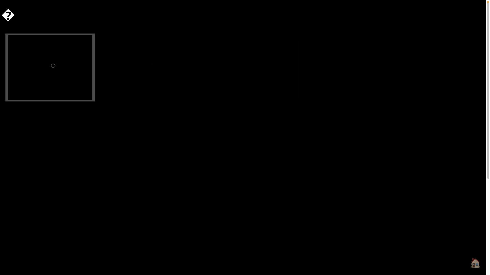

# gallery 🖼️

A Web App to display your images along with essential metadata just by putting it in the Gallery Folder!

## Installation

1. Install Python requirements for preparing the gallery with `pip install -r requirements.txt`

2. Place your original images inside of the gallery under `fulls`.

3. Execute `python prepareSite.py` to generate thumbnails under `thumbs` folder and extract important metadata under `metadata` to display in the gallery!

4. Host your gallery site, a quick way is through `python -m http.server` to see your images at <http://127.0.0.1:8000>!

5. Enjoy your images! You should see a site like what is shown below.

---

## Features 🌟

### 3D Immersive Mode 🌍
Experience your gallery like never before with the new **3D Sphere View**:
- **Dynamic Layout**: Images are arranged in a Fibonacci Sphere that automatically scales based on your gallery size.
- **Interactive Controls**: 
  - **Rotate**: Drag anywhere to spin the gallery.
  - **Zoom**: Scroll or Pinch to fly in and out.
  - **Focus**: Click any image to smoothly transition into a focused "Line View" for detailed inspection.

### Classic 2D Grid ▦
Switch instantly to the traditional **2D Grid View** for a clean, scannable overview of your work.

---

## Operations

Here's how to operate the gallery:

### General
*   **Switch Modes**: Click the **3D / 2D** toggle button (top right) to swap between the immersive sphere and the classic grid.

### Navigating the Gallery
*   **3D Mode**: Drag to rotate, Scroll to zoom. Click an image to enter viewing mode.
*   **2D Mode**: Scroll vertically. Click a thumbnail to open the fullscreen viewer.

### Top Controls
*   **⛶**: Toggle Fullscreen for the entire experience.
*   **3D/2D**: Switch layout modes.

### Fullscreen Viewer
When an image is selected:
*   **Zoom & Pan**: Mouse scroll or pinch to zoom. Drag to pan. Double-click to reset.
*   **Navigation**: Use the bottom thumbnail strip, or press arrow keys `←` / `→`. 
*   **Metadata**: Click `i` or the **Info** button to see EXIF data (Date, Camera, ISO, Location, etc.).
*   **Exit**: Click `✖️` or press `Esc` to return to the gallery.

### Keyboard Shortcuts
*   `←` / `→`: Next/Prev Image.
*   `Esc`: Close Viewer / Reset View.
*   `Enter`: Open selected image.
*   `I`: Toggle Info/Metadata.
*   `F`: Toggle Fullscreen.
*   `T`: Toggle Thumbnails.

### URL Parameters 🔗
Customize the gallery experience using query parameters. Append these to your URL (e.g., `?mode=2d&slideshow`):

*   `?datasaver`: **Data Saver Mode**. Loads lower-resolution thumbnails instead of full-sized images. Ideal for slow connections.
*   `?mode=2d`: Starts the gallery in **2D Grid View** instead of the default 3D Sphere.
*   `?slideshow`: Automatically starts the slideshow upon loading.
*   `?interval=3000`: Sets the slideshow speed in milliseconds (default is 3000ms).
*   `?img=filename`: Deep link to specific image. Opens the gallery with `filename.jpg` selected.
*   `?fullscreen`: Automatically enters fullscreen mode **every time** an image is opened. Exiting fullscreen (e.g., via `Esc`) will also close the image viewer.
*   `?debug`: Enables verbose logging in the browser console.

---

## Example Portfolios using gallery

1. [TheDoShoots](https://timothydo.me/photography) by Timothy Do